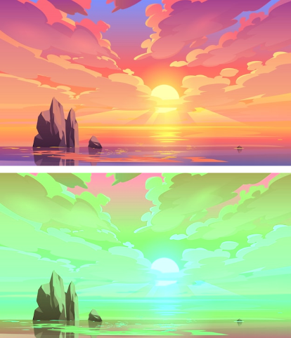
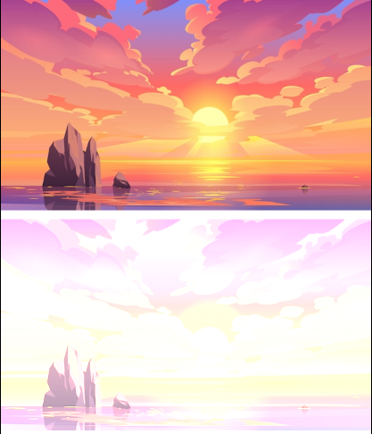
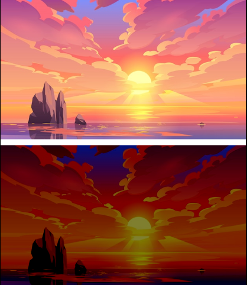
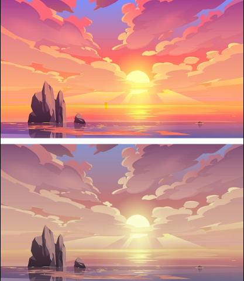
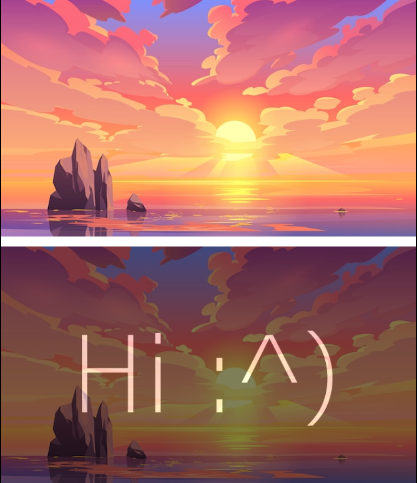
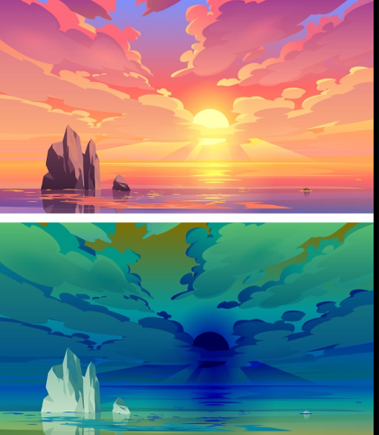
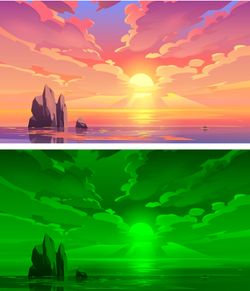
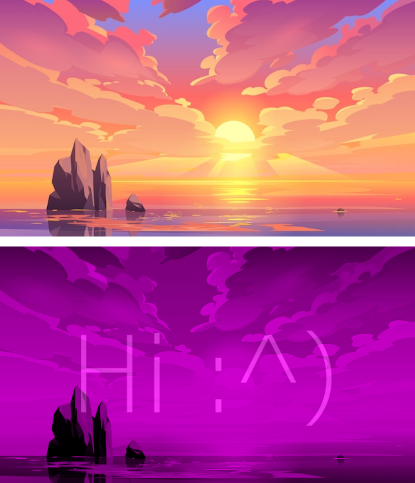

# SimpleFX

A Flutter package that allows to easily apply basic image effects (hue rotation, opacity, saturation, contrast, common filters and channel isolation)

## Features

This package allows to apply following effects to images:

### Hue rotation

Hue rotation filter rotates all of the image's colors around the [hue wheel](https://www.newsshooter.com/wp-content/uploads/2018/07/Hue-color-wheel-by-degree.png). Input parameter is the degree value of an angle. Any value can be specified, including negative ones (rotation by -90 degrees is the same as rotation by 270 degrees)

Usage example:
```dart
SimpleFX(imageSource: image, hueRotation: 110);
```

Result (on the bottom is an image with hue rotated by 110 degrees):



### Brightness

Brightness filter allows to make image brighter or darker. Input parameter is the percentage increase or decrease of brightness (so the range is -100..100 and default value is 0)

Usage example:
```dart
SimpleFX(imageSource: image, brightness: 50);
```

Result (on the bottom left is an image with `brightness: 50`, on the bottom right - with `brightness: -50`):




### Saturation

Saturation filter allows to desaturate images. Input parameter is the percentage of an original saturation (so the range is 0..100 and default value is 100)

Usage example:
```dart
SimpleFX(imageSource: image, saturation: 50);
```

Result (on the bottom is an image with `saturation: 50`):



### Opacity

Opacity filter allows to add transparency to an image. Input parameter is the percentage of an original opacity (so the range is 0..100 and default value is 100)

Usage example:
```dart
Stack(children: [
                SimpleFX(imageSource: image2), //Hidden image
                SimpleFX(imageSource: image, opacity: 50) //Demo image
              ]);
```

Result (on the bottom is an image with `opacity: 50`; hidden image can be seen through it):



### Common filters

This plugin allows to apply some common filters - grayscale, sepia and negative. They are implemented inside of a `SFXFilters` class. `filter` parameter can also take custom filter specified as a 5x4 matrix (for more information, refer to [Flutter documentation](https://api.flutter.dev/flutter/dart-ui/ColorFilter/ColorFilter.matrix.html))

Usage example:
```dart
SimpleFX(imageSource: image, filter: SFXFilters.negative);
```

Result (on the bottom is an image affected by `SFXFilters.negative` filter):



### Channel isolation

This plugin also allows to isolate channels of an image. `channels` parameter takes one of the filters implemented in `SFXChannels` class. It can also take custom isolation array - an array of 3 double values (red, green and blue) in range of 0..1, where 1 is full value of channel, and 0 is removal of a channel.

Usage example:
```dart
SimpleFX(imageSource: image, channels: SFXChannels.green);
```

Result (on the bottom is an isolated green channel of an original image):



## Getting started

This package requires no prerequisites, and can be used in any Dart application

## Usage

An example of SimpleFX filter with all parameters specified.

NOTE: filters are applied in following order: hueRotation = brightness = opacity > saturation > filter > channels

```dart
Stack(children: [
                SimpleFX(imageSource: image2,), //Secret
                SimpleFX(imageSource: image, 
                        hueRotation: 50, 
                        brightness: -50, 
                        saturation: 90, 
                        opacity: 80, 
                        filter: SFXFilters.grayscale, 
                        channels: SFXChannels.magenta) //Demo image
              ]),
```

Result:

